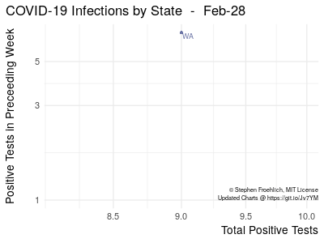
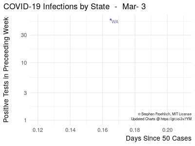

COVID-19 Growth Animation - U.S. States
================

The fight against COVID-19 in the United States is generally coordinated and administered at the state level with the federal government mainly providing resources. As such, each state's response to COVID-19 has differed significantly from that of others. The question is if any are doing a better job than others.

This anmation, inspired by Aatish Bhatia's version based on the [Johns Hopkins Data](https://github.com/CSSEGISandData/COVID-19) at <https://aatishb.com/covidtrends/>. As Johns Hopkins has stopped tracking U.S. State-level data, I instead am pulling that from the [COVID Tracking Project](https://covidtracking.com/)'s very simple and easy-to-use API, which provides a handy JSON download.

If you're here already, you should also check out Datawrapper's excellent [17 (or so) responsible live visualizations about the coronavirus, for you to use](https://blog.datawrapper.de/coronaviruscharts/) page.

This page will be updated just after 6pm MDT every day which is in coordination with the COVID Tracking Project's daily updates.

It is now April 2, and the death wave is about to begin in earnest in the U.S.. Data visualization is generally the wrong medium to help us lament the dead and the soon-to-be dead. If I find something, I will add it, but the only death-driven visualizations I'm including for now are those that help us understand how health systems are doing preventing COVID-19 infections from becoming COVID-19 deaths. In the meantime, I commend N.T. Wright's article for Time <https://time.com/5808495/coronavirus-christianity/> to your reading.

Current Animations
------------------

*Last updated at 2020-04-09 18:07:06 MDT.*

This plot visualizes **infections driving more infections**, and the main take-away is that ***we're all in this together***.

As of April 1, it did appear for the first time that most states have exited their exponental growth lines ... we will see how this continues over the next few days.

 

*Last updated at 2020-04-09 18:07:06 MDT.*

This is an adaptation of [jburnmurdoch](https://twitter.com/jburnmurdoch)'s excellent work for the Financial Times at <https://www.ft.com/coronavirus-latest>, but again with US state-level data. It is better at showing where the infection growth rate is higher and where it is not. Also it gives a decent sense of history for key states so you can see when things began to diverge.

*Last updated at 2020-04-09 18:07:06 MDT.*

This is the most sensitive animation of the bunch ... it will be the quickest indicator of changes in new infections. It is also an adaptation of \[@jburnmurdoch\](<https://twitter.com/jburnmurdoch>)'s work for the Financial Times at <https://www.ft.com/coronavirus-latest>. It shows new positive test results in the preceeding week over time.

*Last updated at 2020-04-09 18:07:06 MDT.*

This plot visualizes **infections driving deaths**.

For interpretation when the data are noisy like this, remember that it is low *slope* that is good more than low *position* ... though the first does eventually lead to the second. As long as positive test result numbers are rising ... *higher slope is better* for this plot. It means either better testing of patients or less deaths per infection.

 

Social Media-sized gifs
-----------------------

Please feel free to share any of these with your networks. When do you post, please link back to <https://git.io/Jv7YM> so that people can get updated data and also see the data provenance - just right-click, copy, and paste. For Twitter, LinkedIn and possibly others save the gif locally and upload it as a photo to get the gif to work.

  

 

How to Read These Charts
------------------------

Basically, we're looking for a state to depart the diagonal line downward, which means that it has exited the exponential growth phase. For more detail, see the following video from **minutephysics**: <https://youtu.be/54XLXg4fYsc>

 

Code
----

-   `README.Rmd` is the primary script. It both writes out the various gifs but is also the Rmarkdown document used to generate the GitHub README.
-   `covid_*_anim.gif` is each full-sized animation.
-   `covid_*_anim_sm.gif` is each social media-sized animation.
-   `update_gif_readme_cron.R` is the script called by the cron job that updates this page ... it renders `README.Rmd` into `README.md`, including with fresh gifs and then pushes the update to GitHub.

 

Appendix - Hospitalization Animations
=====================================

The [COVID Tracking Project](https://covidtracking.com/) is only able to get hospitalizations for some states. As a result as of March 28, it is hard to draw any conclusions from these visualizations, but they may become more telling over time.

### Infections Driving Hospitalizations

*Last updated at 2020-04-09 18:07:06 MDT.*

It would be surprising if this animation showed any ovbious trends that would indicate any home remidies were driving reduced hospitalizations per infection. Instead, the most likely driver of differences is likely to be age differences in the newly-infected populations.

### Hospitalizations Driving Deaths

*Last updated at 2020-04-09 18:07:06 MDT.*

Again, for interpretation when the data are noisy like this, what we hope to see short of hospitalizations dropping so that the point drops below the curve, is an *increase in slope* that shows fewer deaths per hospitalization. However, any decrease in slope over time indicate that health systems are getting better at preventing deaths. Any decreases in slope mean that treatments are becoming less effective.
